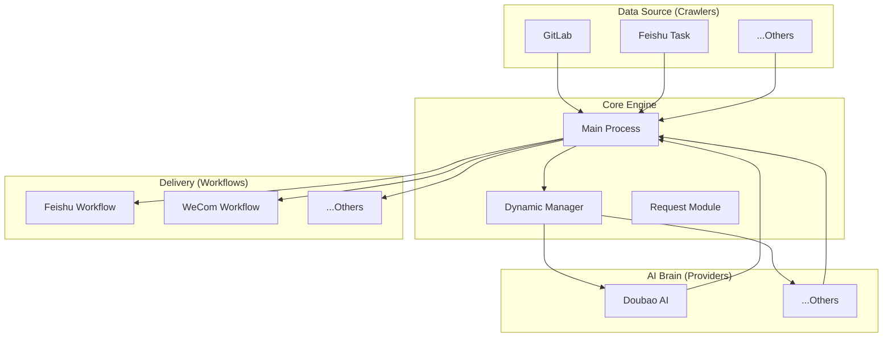

# 🚀 Multi-Bot: 多平台智能自动化助手

[](LICENSE)
[](https://www.python.org/)
[]()

> **Multi-Bot** 是一款工业级、高度可扩展的自动化办公助手框架。它能够跨平台采集数据（GitLab 提交记录、飞书任务等），利用尖端 AI 大模型进行深度总结，并精准推送至多元化终端（飞书、企业微信等）。

---

## ✨ 核心特性

- 🧩 **高度插件化**：爬虫 (Crawlers)、AI 供应商 (Providers)、推送工作流 (Workflows) 均实现完全解耦，支持秒级动态接入。
- 🔍 **多源数据采集**：内置 GitLab 活跃度采集、飞书任务跟踪等模块，支持多账号、多仓库并行采集。
- 🤖 **灵活 AI 驱动**：兼容豆包 (Doubao)、GPT 等主流大模型，支持通过 `AIFactory` 实现动态模型切换。
- 🛡️ **工业级架构**：
  - **统一响应契约**：全系统遵循 Spring Boot 风格的 `Result` 响应规范。
  - **全局异常治理**：内置 `GlobalExceptionHandler` 与 `handle_logic_exception` 装饰器，确保系统健壮性。
  - **无感 OAuth 流程**：完善的 Token 存储、自动刷新及请求重试机制。
- ⚙️ **配置驱动**：全功能通过 `config.yaml` 灵活配置，无需修改核心代码即可调整业务规则。

---

## 🏗️ 系统架构

项目采用“中心化发现，分布式实现”的架构模式：



---

---

## 📂 目录架构

```text
DailyBot/
├── common/              # 公共模块（配置、日志、Token 存储、OAuth FastAPI）
├── tasks/               # 任务模块（定时推送调度器）
├── api/                 # 接口定义（各平台 API 配置，支持动态加载）
├── crawlers/            # 爬虫实现（GitLab、飞书任务等采集逻辑）
├── providers/           # AI 供应商（豆包等大模型适配）
├── request/             # 请求核心（Hooks、平台拦截器、HTTP 封装）
├── workflows/           # 工作流（报告生成流程编排）
├── enums/               # 通用枚举
├── exceptions/          # 异常处理（全局拦截与逻辑异常）
├── config/              # 物理配置文件 (config.yaml)
├── logs/                # 运行时日志
└── main.py              # 程序主入口
```

---

## 🧩 模块导览

| 目录 | 职责说明 | 关键特性 |
| :-- | :-- | :-- |
| `common/` | 公共基础设施 | 统一配置加载、JSDoc 风格日志、无感 Token 刷新机制 |
| `tasks/` | 自动化调度 | 基于 APScheduler 的定时推送任务管理 |
| `api/` | 声明式 API | 支持按平台/功能模块化定义接口，动态加载至 `apis` 对象 |
| `crawlers/` | 数据采集层 | 支持 GitLab/飞书任务，自动去重与时间窗口过滤 |
| `providers/` | AI 适配层 | 统一个性化 Prompt，支持不同模型的能力平滑适配 |
| `workflows/` | 业务流编排 | 支持卡片占位、消息原位更新、多平台分发任务 |
| `request/` | 插件化请求库 | 统一的 `use_request` 模式，内置多平台请求拦截器 |
| `utils/` | 通用工具类 | 类型转换、动态管理等基础工具 |

---

## ⚙️ 配置指南

项目所有的核心逻辑均可通过 `config/config.yaml` 进行高度定制。

### 1. 完整配置示例 (`config.yaml`)

```yaml
# ---------------------------------------------------------
# 1. 平台基础配置 (决定推送终端的行为)
# ---------------------------------------------------------
platforms:
  feishu:
    ai_model: "doubao"            # 该工作流默认使用的 AI 总结模型
    app_id: "cli_..."             # 飞书自建应用 ID
    app_secret: "..."             # 飞书自建应用 Secret
    target_chat_id: "oc_..."      # 目标接收群 ID
    oauth_redirect_uri: "..."     # OAuth 回调地址
    base_url: "https://open.feishu.cn"

  wecom:
    ai_model: "doubao"
    corp_id: "ww..."              # 企业微信 CorpID
    corp_secret: "..."            # 应用 Secret

# ---------------------------------------------------------
# 2. AI 模型供应商配置
# ---------------------------------------------------------
models:
  doubao:
    api_key: "..."                # 豆包 API Key
    base_url: "..."               # 接口网关地址
    model: "doubao-pro-4k"        # 使用的具体模型 ID

# ---------------------------------------------------------
# 3. 采集源 (爬虫) 配置
# ---------------------------------------------------------
repos:
  gitlab:
    token: "..."                  # GitLab Private Token 或 Personal Access Token
    base_url: "https://git..."    # 您的 GitLab 地址
    target_user: "username"       # 默认要统计提交记录的用户 (可选)
    repos:
      # 简易配置
      - path: "group/project-a"
        branch: "master"
        name: "核心业务后台"      # 在日报中显示的别名
      
      # 进阶配置：指定爬取日期区间
      - path: "frontend/ui-library"
        branch: "develop"
        name: "组件库"
        crawl_dates:
          - "2026-01-01, 2026-01-08"  # 支持日期区间
          - "2026-02-10"              # 支持单日日期

# ---------------------------------------------------------
# 4. 全局调度开关
# ---------------------------------------------------------
# 启用的工作流，名称必须与 platforms 中的 key 对应
enabled_workflows: ["feishu", "wecom"]

# 日志级别: DEBUG, INFO, WARNING, ERROR
log:
  level: "INFO"
```

### 2. 扩展配置深度解析

#### 🧩 动态日期爬取 (`crawl_dates`)
如果您需要补录旧的报告或进行周期性回顾，可以在仓库配置中添加 `crawl_dates` 数组。
- **单日格式**: `"YYYY-MM-DD"`
- **区间格式**: `"START_DATE, END_DATE"` (以英文逗号分隔)
> [!TIP]
> 如果省略该配置，爬虫会自动获取 **当前日期** 的提交记录。

#### 🏷️ 仓库别名 (`name`)
为了让生成的日报更具可读性，建议为每个仓库配置 `name` 字段。AI 在生成总结时会优先使用该别名，从而避免展示冗长的项目路径。

#### 🔄 多工作流并行 (`enabled_workflows`)
系统支持同时向多个终端推送。例如，您可以配置 `enabled_workflows: ["feishu", "wecom"]`，系统会为 GitLab 的同一采集结果，分别触发飞书和企业微信的总结与推送流程。

---

## 🛠️ 高级用法

### 统一异常处理范式
在任何业务方法中，您只需抛出 `BusinessException` 或使用 `@handle_logic_exception`：

```python
from exceptions.base import BusinessException
from exceptions.handler import handle_logic_exception

@handle_logic_exception
def process_data():
    if not data:
        raise BusinessException(msg="采集数据为空")
```

---

## 🚀 快速开始

```bash
# 初始化环境
python -m venv .venv
source .venv/bin/activate
pip install -r requirements.txt

# 运行系统
python main.py
```

