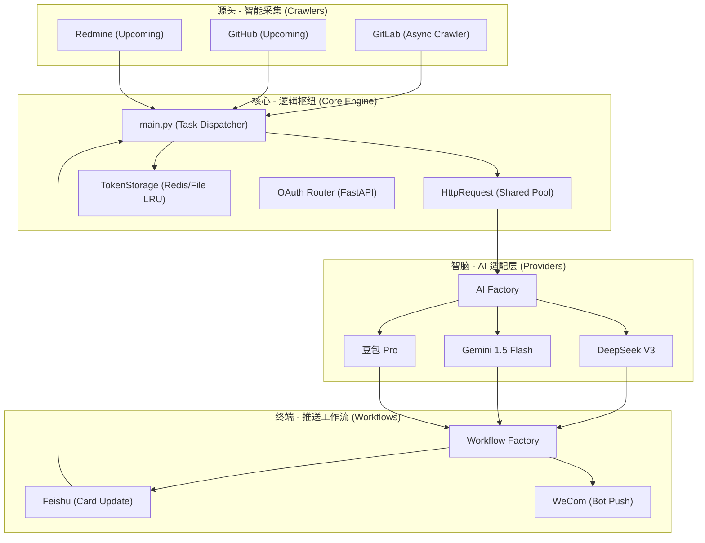

<div align="center">
  
  <h1>🐱 日报喵 (DailyBot)</h1>
  <p><b>工业级 · 全异步 · 插件化 · AI 驱动的日报自动化专家</b></p>
  <br />
  <a href="https://www.python.org/"></a>
  
  <a href="https://fastapi.tiangolo.com/"></a>
  <a href="LICENSE"></a>
  
</div>

---

## 🌟 项目背景与简介

### 1. 为什么会有“日报喵”？
在现代软件开发流程中，开发者往往需要跨多个平台（GitLab, Jira, Redmine）记录自己的工作足迹。每到下班时分，手动整理成百上千条提交记录并撰写出一份逻辑清晰、重点突出的日报，往往耗时耗力。

**日报喵 (DailyBot)** 应运而生。它不仅是一个脚本，更是一个**智能化的工作伙伴**。它能自动潜入您的代码库，提取当日成果，通过 AI 智脑进行语义润色，并以最专业的形式推送到您的办公平台（飞书、企业微信等）。

### 2. 核心价值
- **自动化采集**：告别手动翻阅 Git Commit。
- **智能总结**：AI 自动过滤碎片化代码信息，提炼出具有业务价值的成果陈述。
- **极致体验**：支持 RPA 自动化填报，实现从采集到填报的全流程闭环。

---

## 🔥 核心特色功能

### 1. ⚡ 全链路异步深度重构
- **极速性能**：全程采用 `httpx` + `asyncio`，从 API 调用到数据落盘全异步化。
- **高并发支持**：多仓库采集任务通过 `asyncio.gather` 并行执行，即便有数十个仓库也能在秒级完成。

### 2. 🛡️ 智能 OAuth 引导 (Nudge)
- **Token 闭环管理**：实时监测 Token 有效性。若检测到未授权，系统会自动向群聊发送 **“智能引导卡片”**。
- **零中断授权**：用户仅需点击卡片按钮，系统即时捕获凭据并自动恢复工作流，无需人工干预配置文件。

### 3. 🧩 极致解耦的“插件化”架构
- **解耦设计**：支持动态扫描并加载 `Crawlers`（采集器）、`RPA`（执行器）和 `Providers`（AI 供应商）。
- **声明式 API**：仿前端 Axios 的声明式设计，业务逻辑只需关心调用，认证注入与异常拦截全自动化处理。

### 4. 🤖 智脑请求共享机制
- **模型去重**：若多个推送平台配置了相同的 AI 模型（如都用豆包），系统会自动合并请求。在单次运行中，相同模型的 AI 请求仅触发一次，极大节省 Token 消耗并保持总结的一致性。

---

## 🏗️ 极致打包与分发 (EXE)

日报喵支持**单体 EXE 极致分发方案**：

### 1. 傻瓜式运行
- **免安装环境**：生成的 `DailyBot.exe` 可以在未部署 Python 的环境下直接运行。
- **自动初始化**：程序内置浏览器环境自检。如果开启了 RPA 填报但缺少驱动，**程序会在首次启动时自动通过后台下载安装 Chromium**，实现真正的“开箱即用”。

### 2. 如何打包？
如果您进行了二次开发，可以运行以下命令重新生成执行文件：
```bash
# 安装打包依赖
pip install pyinstaller

# 执行一键打包逻辑 (配置文件已整理至 scripts 目录)
pyinstaller scripts/DailyBot.spec --clean --noconfirm
```
成品将生成在 `dist/` 目录下，包含 `DailyBot.exe` 及必需的配置模板。

---

## 🏗️ 技术架构全景图



---

## 📂 项目结构解析

```text
DailyBot/
├── main.py              # 🚀 核心入口：控制全链路流转与浏览器自动环境初始化
├── push_scheduler.py    # ⏰ 守护进程：基于 Cron 规则的定时推送服务
├── config/              # ⚙️ 配置中心：config.yaml 静态配置存放
├── scripts/             # 🛠️ 运维脚本：PyInstaller 打包配置 (.spec) 与启动脚本
├── api/                 # 📡 接口定义：各平台声明式 API 映射
├── crawlers/            # 🔍 智能采集：各平台 Commits 爬虫实现
├── rpa/                 # 🖱️ 自动化执行：Playwright 驱动的表单自动填报逻辑
├── providers/           # 🤖 模型适配：各 AI 大模型的 Payload 与解析器
├── request/             # 🌐 通讯方案：底层 httpx 异步封装与平台拦截器
├── token_storage/       # 🗄️ 凭据存储：支持 Redis 或文件驱动
└── utils/               # 🔧 核心组件：动态模块发现器 (DynamicManager) 与路径助手
```

---

## 🚀 极简上手指南

### 1. 环境准备
```bash
# 克隆项目并进入
git clone https://github.com/your-repo/DailyBot.git
cd DailyBot

# 创建并激活虚拟环境 (Windows)
python -m venv .venv
.venv\Scripts\activate

# 安装全量依赖
pip install -r requirements.txt
```

### 2. 秘钥配置
1. 复制 `.env.example` 为 `.env`。
2. 根据注释填写您的 `GITLAB_TOKEN` 和 AI 模型密钥。

### 3. 开始执行
```bash
# 手动单次运行
python main.py

# 生产环境常驻运行
python push_scheduler.py
```

---

## ⚙️ 配置手册

### 📁 `.env` (敏感信息)
| 变量名 | 必填 | 说明 |
| :--- | :--- | :--- |
| `GITLAB_TOKEN` | 是 | 用于采集代码记录的 Personal Access Token |
| `DOUBAO_API_KEY` | 否 | 豆包 AI 的密钥 (模型使用必填) |
| `REDIS_HOST` | 否 | Redis 地址 (若使用 redis 驱动) |

### 2. `config.yaml` 详尽配置手册
```yaml
# ==========================================
# 🐱 日报喵 (DailyBot) 核心配置文件
# ==========================================

# --- 1. 业务平台配置 (推送目的地与 RPA 行为) ---
platforms:
  feishu:
    ai_model: "doubao"        # 绑定 AI 模型 (需在 models 中定义)
    target_chat_id: "oc_xxx"  # 接收日报的群聊 ID
    oauth_redirect_uri: "http://127.0.0.1:8001/feishu/callback"
    base_url: "https://open.feishu.cn"

  wecom:
    ai_model: "doubao"
    rpa:
      enabled: true           # 是否开启 RPA 自动化填报
      speed: 1                # 模拟真人速度: 1 (慢) ~ 0.1 (快)
      auto_submit: false      # 是否自动点击“提交”
      browser_type: "chrome"  # 驱动: "chrome" 或 "msedge"
      form_url: "https://doc.weixin.qq.com/journal/create?docid=xxx"

# --- 2. AI 模型供应商配置 (智脑负载) ---
models:
  doubao:
    name: "豆包 Pro"
    api_key: "${DOUBAO_API_KEY}" # 从 .env 动态注入
    base_url: "https://ark.cn-beijing.volces.com/api/v3"
    model: "doubao-pro-xxxx"    # Endpoint ID
    params:
      temperature: 0.7
      timeout: 60

  deepseek:
    name: "DeepSeek V3"
    api_key: "${DEEPSEEK_API_KEY}"
    base_url: "https://api.deepseek.com/v1"
    model: "deepseek-chat"

# --- 3. 代码仓库配置 (数据源) ---
repos:
  gitlab:
    token: "${GITLAB_TOKEN}"
    base_url: "http://git.xxx.com"
    target_user: "liangan"     # 默认采集的开发者账号
    repos:
      - path: "dev/project-a"  # 仓库路径
        branch: "master"       # 采集分支
        name: "核心工程"        # 友好展示名称

# --- 4. 全局开关与调度 ---
enabled_workflows: ["feishu", "wecom"] # 启用的推送平台

scheduler:
  enabled: true
  auto_start: true           # 是否开机自启
  default_time: "18:20"      # 默认运行时间
  tasks:
    - time: "18:30"
      weekdays: [1, 2, 3, 4, 5] # 每周一至周五运行
```
