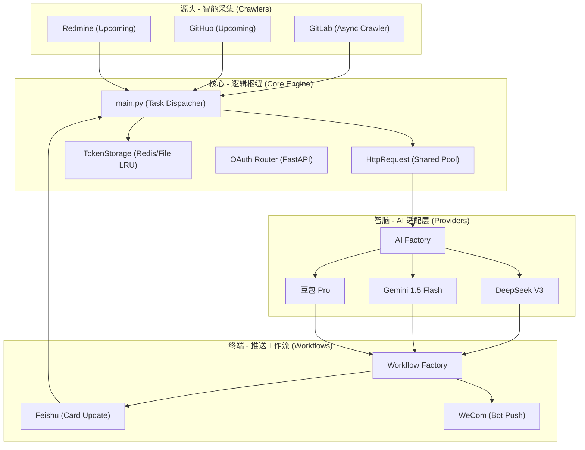

<div align="center">
  
  <h1>🐱 日报喵 (DailyBot)</h1>
  <p><b>工业级 · 全异步 · 插件化 · AI 驱动的日报自动化专家</b></p>
  <br />
  <a href="https://www.python.org/"></a>
  
  <a href="https://fastapi.tiangolo.com/"></a>
  <a href="LICENSE"></a>
  
</div>

---

## 🌟 项目简介

**日报喵 (DailyBot)** 是一款专为高效职场人打造的自动化伴侣。它深度整合了 GitLab 采集、AI 智能语义分析与多端推送流程，通过 **全链路异步协程架构** 实现极致的运行效率。

不同于传统的脚本，日报喵具备完善的 **OAuth 自动维护机制 (Nudge)** 和 **插件化发现系统**，能够真正做到“一次配置，终身无忧”。

---

## 🔥 项目核心亮点

### 1. ⚡ 全链路异步深度重构
- **极速性能**：全程采用 `httpx` + `asyncio`，从 API 调用到数据落盘全异步化。多仓库采集任务通过 `asyncio.gather` 并行执行，即便有数十个仓库也能在秒级完成。
- **高并发支持**：主循环基于事件驱动，能够稳定处理大规模的回调与并发推送任务。

### 2. 🛡️ 业内领先的智能 OAuth 引导 (Nudge)
- **Token 闭环管理**：实时监测 Token 有效性。若检测到未授权，系统不再只是静默报错，而是会主动向群聊发送 **“智能引导卡片”**。
- **零中断授权**：用户仅需在移动端点击授权按钮，系统通过内置的 FastAPI 回调服务即时捕获凭据并自动恢复工作流，无需人工干预配置文件或重启服务。

### 3. � 极致解耦的“插件化”架构
- **零代码接入 AI**：支持 `DeepSeek`、`Gemini`、`Doubao` 等多模型切换。通过统一的 `BaseAIProvider` 接口，接入新模型仅需在 `config.yaml` 增加配置。
- **声明式 API 定义**：仿前端 Axios 的声明式设计，业务逻辑只需调用 `apis.feishu.im.send`，底层的认证头注入、路径占位符解析、异常拦截全自动化处理。

### 4. �️ 生产级多驱动存储
- **分布式友好**：原生支持 `Redis` 存储，适用于集群部署，保证百万级 Token 随时可用。
- **单机极简**：提供 `File (JSON)` 驱动，开箱即用，自动处理文件锁与原子化写入。

---

## 🏗️ 技术架构全景图



---

## 📂 详尽目录结构解析

```text
DailyBot/
├── .env         # 环境变量模板，定义所有敏感 Key
├── main.py              # 系统总入口，控制全链路异步流转
├── push_scheduler.py    # 基于 APIScheduler 的定时推送守护进程
├── api/                 # 声明式 API 定义层
│   └── modules/         # 各平台接口定义 (feishu, gitlab, gemini 等)
├── common/              # 公共逻辑，包含全局配置加载与日志初始化
├── config/              # 物理配置文件存放区 (config.yaml)
├── crawlers/            # 各平台采集器，子类需继承 BaseCrawler 实现异步抓取
├── enums/               # 系统枚举，如响应码 (ResultCode)
├── exceptions/          # 统一异常体系，含全局拦截器与语义化报警
├── oauth/               # OATH 相关路由、回调逻辑及智能引导卡片模板
├── prompts/             # 针对不同场景精心调优的 AI Prompt 模板
├── providers/           # AI 模型适配器，负责 Payload 生成与 JSON 回收
├── request/             # 底层通讯库
│   ├── core/            # 封装 httpx，含全局连接池、URL 治理、Hook 调度器
│   └── platforms/       # 平台专属拦截器 (如飞书 401 自动纠错拦截)
├── token_storage/       # 多介质存储驱动 (Redis/File)，含并发原子锁机制
├── utils/               # 工具类，如动态模块发现器 (DynamicManager)
└── workflows/           # 多平台工作流，含卡片原位更新与生命周期钩子
```

---

## 🚀 极简上手指南

### 1. 环境准备
```bash
# 克隆项目并进入
git clone https://github.com/your-repo/DailyBot.git
cd DailyBot

# 创建并激活虚拟环境
python -m venv .venv
source .venv/bin/activate  # Windows 下使用 .venv\Scripts\activate

# 安装全量依赖
pip install -r requirements.txt
```

### 2. 秘钥配置
复制 `.env.example` 为 `.env`，并根据实际情况填写（建议填入 `GEMINI_API_KEY` 以获得最佳免翻体验）。

### 3. 开始猫咪执行
```bash
# 模式 A: 手动单次运行 (推荐首次调试)
python main.py

# 模式 B: 生产定时运行
python push_scheduler.py
```

---

## ⚙️ 深度配置示例 (`config.yaml`)

```yaml
# 启用的终端平台清单
ENABLED_WORKFLOWS: ["feishu"]

platforms:
  feishu:
    ai_model: "gemini"        # 本平台绑定的 AI 总结模型
    target_chat_id: "oc_xxx"  # 飞书群聊 ID (日报发送目的地)
    base_url: "https://open.feishu.cn"

models:
  gemini:
    name: "Gemini 1.5 Flash"
    api_key: "${GEMINI_API_KEY}" # 支持 ${ENV} 语法注入
    base_url: "https://generativelanguage.googleapis.com/v1beta"
    model: "gemini-2.5-flash"

repos:
  gitlab:
    token: "${GITLAB_TOKEN}"
    base_url: "http://your-gitlab.com"
    target_user: "username"
    repos:
      - path: "dev/frontend"
        branch: "master"
        name: "前端核心工程"

redis:
	host: 127.0.0.1
	port: 6593
	database: 0
	password: ""
```

---

## 🛠️ 高级进阶特性

- **URL 尾斜杠自动纠偏**：底层 `HttpRequest` 会自动判定 URL 接驳处的斜杠，确保 Google Gemini 等极其敏感的 API 不会因多一个 `/` 而报 404。
- **JSON 智能解析器**：内置 AI 响应提炼逻辑，即使模型输出了包含 MarkDown 标签的垃圾字符，系统也能精准提取有效的 JSON 报文。
- **环境变量动态注入**：支持在 `config.yaml` 中使用变量语法，完美适配配置中心。

---

## 📄 开源说明

本项目基于 **MIT License** 开源。
