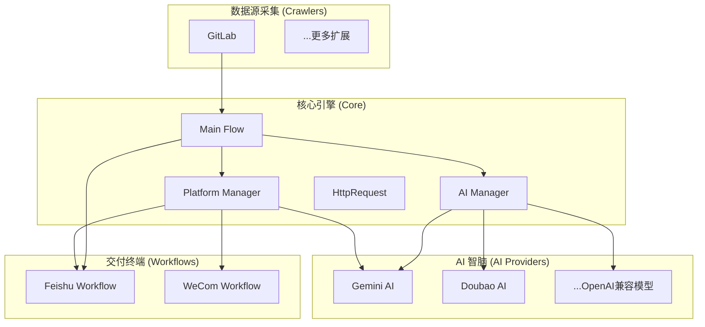

# 🐱 日报喵 (DailyBot): 多平台智能日报自动化助手

[](LICENSE)[](https://www.python.org/)[]()[]()

> **日报喵** 是一款工业级、高度可扩展的自动化办公助手。它能精准采集多源数据（GitLab 提交记录、项目进展等），利用 Google Gemini 或字节豆包等主流大模型进行深度语义总结，并以精美的交互式卡片形式推送至飞书、企业微信等平台。

---

## ✨ 核心特性

- 🚀 **全自动日报流**：从原始 Commit 爬取到 AI 智能总结，再到推送，全链路自动化，无需人工干预。
- 🧩 **高度组件化架构**：
  - **平台插件 (Platforms)**：专用适配器（如 `GeminiPlatform`），完美处理特定认证与链路逻辑。
  - **AI 提供商 (Providers)**：支持 Gemini 3 Flash、豆包、智谱等，支持“零代码”配置接入新模型。
  - **无缝 OAuth**：内置完善的 Token 存储与自动刷新机制，彻底告别 401 困扰。
- 🤖 **顶尖 AI 能力**：针对日报场景深度优化的 Prompt 系统，让总结更具逻辑性与可读性。
- 📊 **精美推送卡片**：支持飞书交互式卡片，具备“原位更新”能力，显著减少消息打扰。
- 🛡️ **生产级稳定性**：统一响应契约 (Result 类)、全局异常治理、自动重试机制。

---

## 🏗️ 系统架构

项目采用“单一职责，动态发现”的架构模式：



---

## 📂 目录导航

```text
DailyBot/
├── api/                 # 声明式 API 定义（支持路径占位符替换）
├── common/              # 公共模块（配置中心、Token 持久化存储）
├── crawlers/            # 采集器实现（目前支持 GitLab 活跃度采集）
├── providers/           # AI 驱动层（负责 Payload 构造与响应解析）
├── request/             # 请求核心（包含 Hook 机制与各平台专属拦截器）
│   ├── platforms/       # 平台插件实现（如 feishu, gemini 专属逻辑）
│   └── core/            # HTTP 封装与 URL 鲁棒性治理
├── workflows/           # 业务流程编排（占位卡片、原位更新、差异化分发）
├── config/              # 物理配置文件 (config.yaml)
└── main.py              # 程序启动入口
```

---

## ⚙️ 快速配置 (`config.yaml`)

项目所有行为均通过 `config/config.yaml` 驱动，无需修改代码。

```yaml
# 1. 终端平台配置
platforms:
  feishu:
    ai_model: "gemini"            # 指定该平台使用的 AI 模型
    target_chat_id: "oc_..."      # 飞书群 ID
    standup_time: "09:00"         # 预定的日报发送时间
    base_url: "https://open.feishu.cn"

# 2. AI 模型库 (Gemini/豆包/自定义)
models:
  gemini:
    name: "Gemini 3 Flash"
    api_key: "AIzaSy..."          # 您的 Google API Key
    base_url: "https://generativelanguage.googleapis.com/v1beta"
    model: "gemini-3-flash-preview"
    params:
      timeout: 60                 # 超时配置(s)

  doubao:
    name: "豆包 Pro"
    api_key: "..."
    base_url: "..."
    model: "ep-..."

# 3. 数据采集源 (GitLab)
repos:
  gitlab:
    token: "..."                  # GitLab 访问令牌
    base_url: "http://git..."
    target_user: "your_name"
    repos:
      - path: "project/path"
        branch: "master"
        name: "我的核心项目"
```

---

## 🛠️ 高级特性说明

### 1. URL 鲁棒性拼接
系统内置了智能 URL 治理逻辑，自动处理 `base_url` 与相对路径之间的斜杠关系，有效规避 Google API 对尾部斜杠极其敏感导致的 404 错误。

### 2. 插件发现机制
通过 `PlatformManager` 采用懒加载与按需同步技术，系统会自动优选对应的平台插件（如 `GeminiPlatform`）来接管请求生命周期，实现认证头（Header）的纯净注入。

### 3. 环境隔离与覆盖
所有配置项均支持通过 `.env` 环境变量进行覆盖，方便在容器化环境（如 Docker/K8s）中动态部署。

---

## 🚀 启动指南

```bash
# 1. 安装依赖
pip install -r requirements.txt

# 2. 配置秘钥
cp .env.example .env  # 填写您的 API Key 等敏感信息

# 3. 开启猫咪
python main.py
```

---

## 📄 开源协议
本项目遵循 [MIT License](LICENSE) 协议。

